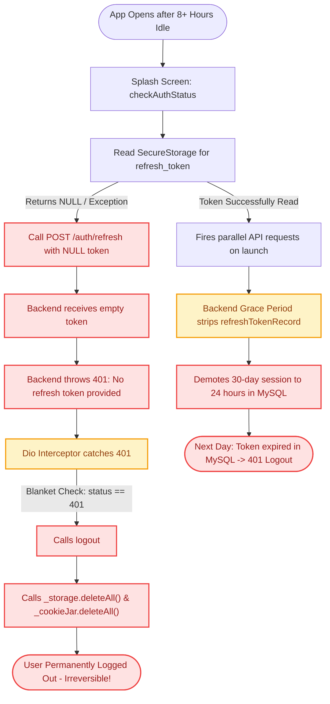
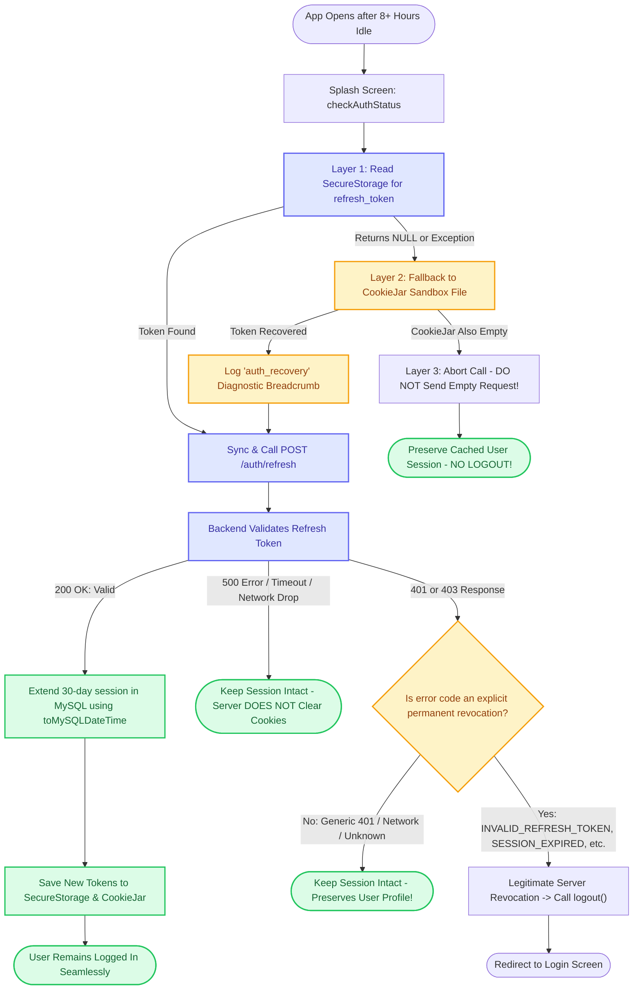

# MANO HRM — Authentication & Session Persistence Architecture

> **Document Scope:** Overview of premature mobile logout issues, root cause investigation, implemented architectural solutions, diagnostic strategy, and long-term future compatibility analysis.

---

## 1. Executive Summary

Mobile users on client devices were experiencing unexpected logouts after extended periods of inactivity (8+ hours / overnight), despite the system's intended policy of **30-day persistent sessions**. Meanwhile, developer devices did not readily reproduce the problem.

Through a rigorous forensic review of both the mobile client ([MANO-HRM-App](file:///d:/Projects/MANO-HRM-App)) and the backend API ([Attendance-Web](file:///d:/Projects/Attendance-Web)), we identified that the issue was not a single failure point, but a **cascade of client-side and server-side edge cases**:
1. Concurrency and date-formatting bugs on the backend silently shortening session lifespans.
2. Fragile client-side local token retrieval on specific mobile devices.
3. An aggressive client-side interceptor that treated any `401` or `403` as an immediate command to wipe local storage and persistent cookies.

### The Primary Failure Chain

```text
1. Storage Loss (Client) ──► 2. Empty Request (Client) ──► 3. Legitimate 401 (Server)
                                                                   │
                                                                   ▼
5. Real Logout (Fatal)   ◄── 4. Interceptor Panic (Client) ◄───────┘
```

1. **Some client devices experienced loss/failure of refresh-token retrieval** after extended inactivity.
2. **The client treated the missing credential as a reason to attempt refresh** with a null/empty token (`POST /auth/refresh`).
3. **The backend correctly rejected that malformed refresh request** with `401 Unauthorized ("No refresh token provided")`.
4. **The client interceptor incorrectly interpreted the generic 401** as proof that the user's session had been revoked.
5. **`logout()` then deleted the client's remaining persistent credentials** (`_cookieJar.deleteAll()` and `_storage.deleteAll()`), converting a recoverable local-storage problem into a permanent, real logout.
6. **Independently, the backend contained a concurrency/grace-period defect** that could demote a 30-day persistent token to a 24-hour lifetime in the database.

---

## 2. Flow Comparison: Previous vs. Current Architecture

### A. The Previous Model (Vulnerable & Self-Destructive)



---

### B. The Current Model (Resilient Multi-Layer Architecture)



---

## 3. Problems Faced & Symptoms Observed

### Symptom A: Premature Daily / Overnight Logout
* **Symptom:** Users logged in with "Remember Me" (intended for 30 days) were forced back to the sign-in screen every morning or after 8–12 hours of idle time.
* **Device Disparity:** The issue occurred reliably on certain client Android devices, but did not occur on local developer testing devices.

### Symptom B: Self-Inflicted False 401 Cascades
* When local secure storage returned `null` upon app launch, the client fired `POST /auth/refresh` with an empty or `null` token payload.
* The backend legitimately rejected the empty request with `401 Unauthorized ("No refresh token provided")`.
* The client's response interceptor caught the 401, panicked, executed `logout()`, and deleted both `FlutterSecureStorage` and `PersistCookieJar` files from the phone's disk.

### Symptom C: Inability to Diagnose Remote Client Devices
* Because the failure occurred in production on remote client hardware without USB debugging or Logcat access, the engineering team lacked visibility into whether local reads were throwing platform exceptions or returning `null`.

### Symptom D: Local Connection Failures (.env Placeholder)
* A placeholder IP in `.env` (`API_BASE_URL="http://192.168.1.X:5000/api"`) was temporarily causing `DioException [connection error]` on device runs when attempting to fetch authentication assets (like captchas).

---

## 3. Root Cause Analysis: Why Did It Happen?

```text
                                  MORNING APP OPEN
                                         │
                   ┌─────────────────────┴─────────────────────┐
                   ▼                                           ▼
         [Backend Vulnerabilities]                  [Client Storage Failures]
  1. Grace period dropped token record       1. Local SecureStorage read returned
     → remember_me became false                 null on specific client devices.
     → 30-day downgraded to 24-hr.           2. Client fired POST /auth/refresh
  2. JavaScript Date object passed to           with empty/null payload.
     MySQL update instead of formatted       3. Backend returned 401.
     toMySQLDateTime string.                 4. Client interceptor caught 401 and
  3. Backend cleared cookie on 500s.            nuked its own persistent cookies.
                   │                                           │
                   └─────────────────────┬─────────────────────┘
                                         ▼
                             PREMATURE SESSION DESTRUCTION
```

### A. Backend Root Causes
1. **The "Grace Period" Token Record Drop:**
   * When an app opens, multiple screens load concurrently (profile, notifications, attendance, chat), sending 5–10 simultaneous network requests. Because access tokens expire in 15 minutes, all requests hit `401` simultaneously and invoked `/auth/refresh`.
   * While the backend had a concurrency grace period, it returned `{ user, gracePeriodActive: true, activeRefreshToken }` **without attaching `refreshTokenRecord`**.
   * `authService.js` fell back to `rememberMe = false`, shortening the token expiration in the database and cookie to 1 day instead of 30 days.
2. **Raw Date Object in MySQL Update:**
   * When extending the sliding session, `extendRefreshToken()` passed a raw JavaScript `Date` object (`expires_at = expiresAt`) into Knex instead of converting it using `toMySQLDateTime(expiresAt)`.
3. **Panic Cookie Clearing on Transient Errors:**
   * In `authController.js`, `refreshToken`'s catch block cleared the HTTP cookie on *any* error (including temporary database spikes or 500 errors).

### B. Client-Side Root Causes
1. **Single Point of Failure in Credential Retrieval:**
   * The app relied exclusively on `FlutterSecureStorage.read(key: 'refresh_token')`. If secure storage failed or returned `null`, the client had no fallback mechanism.
2. **Sending Empty Refresh Requests:**
   * If `savedRefreshToken` was `null`, the client still sent `POST /auth/refresh` with `{ refreshToken: null }`, inducing a guaranteed 401 response from the server.
3. **Equating Any 401/403 with Total Session Invalidation:**
   * The client previously treated any 401 status code as proof that the session had been revoked. In reality, a 401 can occur because of network proxies, missing headers, or temporary auth mismatches.

### C. Was Local Storage "The Main Issue"? (The Trigger vs. The Fatal Flaw)

A central question in this investigation was: **Was storing the token in local storage the main issue?**

The answer is nuanced:

1. **The Initial Trigger (Local Storage Retrieval):**
   * **Yes.** On specific client devices after long idle periods (8+ hours), `FlutterSecureStorage.read(key: 'refresh_token')` failed to retrieve the token and returned `null`.
2. **The Fatal Flaw (The Self-Destructive Client Reaction):**
   * **No.** A local storage read failure should **never** destroy a user's session. The server never told the client that the user was logged out or that their 30-day session had expired.
   * Instead, the client panicked:
     * It sent an empty request (`POST /auth/refresh` with `null`).
     * The backend legitimately returned `401 ("No refresh token provided")`.
     * The client's response interceptor caught the 401 and executed `await logout()`.
     * Inside `logout()`, the client **actively executed `_cookieJar.deleteAll()` and `_storage.deleteAll()`**, wiping out its own persistent cookie files and user cache!
3. **The Hidden Backend Bug (24-Hour Session Demotion):**
   * Even on devices where local storage was 100% stable, the backend's concurrency grace-period bug was stripping `refreshTokenRecord` during parallel morning requests, silently resetting 30-day sessions into 1-day sessions in the MySQL database.

| Problem Layer | Category | What Actually Happened |
| :--- | :--- | :--- |
| **Local Storage Read Returning `null`** | **The Spark (Trigger)** | Secure storage failed to return the token after long idle times on certain devices. |
| **Sending Empty Refresh Payload** | **The Client Error** | App called `/auth/refresh` with `null` instead of aborting or checking fallbacks. |
| **Blanket `logout()` on 401** | **The Fatal Flaw** | Client self-destructed: wiped its own persistent cookie jar and secure storage. |
| **Backend Grace-Period Downgrade** | **The Server Bug** | Server demoted 30-day tokens to 24-hr tokens in MySQL during parallel requests. |

### D. The App Startup Flow: Why `POST /auth/refresh` is Called on Launch

A frequent question is: *Why was the refresh API being called at all when the user just opened the app?*

Because of how the application validates saved sessions on launch:

```text
               User opens app
                     │
                     ▼
          [SplashScreen] in main.dart
                     │
             Calls _checkAuth()
                     │
                     ▼
     authService.checkAuthStatus()
                     │
         Line 763: Calls refreshToken()
                     │
                     ▼
        POST /auth/refresh is fired!
```

1. **The Startup Sequence in [main.dart](file:///d:/Projects/MANO-HRM-App/lib/main.dart#L373-L384):**
   * As soon as the app displays the splash screen (`"Initializing MANO..."`), it calls `_checkAuth()`.
   * `_checkAuth()` awaits `authService.checkAuthStatus()`.
2. **The Session Verification Logic in [auth_service.dart](file:///d:/Projects/MANO-HRM-App/lib/shared/services/auth_service.dart#L762-L766):**
   * To verify whether the user's session is still valid and slide the token window, `checkAuthStatus()` proactively calls `refreshToken()`.
   * `refreshToken()` reads the stored refresh token and fires `POST /auth/refresh`.
3. **The Timing of the Failure:**
   * Because `POST /auth/refresh` is the **very first network call** on startup, any local storage failure was immediately triggered on the splash screen before the dashboard could render.

---

### E. Why Does `FlutterSecureStorage` Return `null` on Android? (5 Concrete Reasons)

Under the hood on Android, `flutter_secure_storage` does **not** store plaintext. It stores an encrypted XML file (`FlutterSecureStorage.xml`) inside the app's sandboxed `shared_prefs` directory, where the encryption key is protected by the hardware **Android KeyStore** (the secure enclave on the phone).

There are 5 evidence-based reasons why `_storage.read(key: 'refresh_token')` can return `null`:

1. **Hardware KeyStore Decryption Exceptions (Caught Silently):**
   * When `_storage.read()` executes, native Android initializes `Cipher.init(Cipher.DECRYPT_MODE)`.
   * On certain Android OEM ROMs after deep sleep, low-memory background kills, or OS security updates, the hardware cipher throws an exception (such as `BadPaddingException`, `InvalidKeyException`, or `UnrecoverableKeyException`).
   * The plugin's native layer catches the exception and returns `null` to Dart because it cannot decrypt the ciphertext.
2. **A Previous Self-Inflicted Logout Already Deleted It:**
   * If the app hit a network timeout, temporary 500 error, or backend grace-period hiccup yesterday, the old error handler executed:
     ```dart
     await logout(); // Ran: await _storage.deleteAll();
     ```
   * The token was already wiped yesterday. When opened today, `_storage.read()` legitimately found nothing.
3. **Android Auto-Backup Master Key Mismatch:**
   * Android by default has auto-backup enabled (`android:allowBackup="true"`).
   * Android backs up the encrypted XML file to Google Drive / local backup.
   * **The Trap:** The hardware KeyStore master key is **non-exportable hardware** (it physically cannot leave the phone's chip).
   * If the app was reinstalled, restored, or migrated, the encrypted XML file exists on disk, but the hardware key is gone. Decryption fails, returning `null`. *(Setting `android:allowBackup="false"` prevents this desynchronization).*
4. **Aggressive OEM "Cleaner" / Battery Optimizers:**
   * Custom Android skins (Xiaomi MIUI/HyperOS Cleaner, Vivo iManager, Samsung Device Care) run automated scheduled cleanup tasks. When RAM or storage is constrained, they can terminate background Keystore services or clear unprotected preferences.
5. **Lock Screen / Biometric Credential Changes:**
   * If a user updates their lock screen PIN, pattern, or biometric data, the Android KeyStore by security design marks hardware-backed keys as permanently invalidated (`KeyPermanentlyInvalidatedException`), making prior encrypted tokens permanently unreadable.

---

### F. Misconceptions Explicitly Avoided
* **Unverified Keystore Hypotheses:** We avoided assuming that Android Keystore keys were "dropped from memory during deep sleep" without empirical device logs.
* **Outdated Configuration Flags:** We checked `pubspec.lock` and confirmed `flutter_secure_storage: 10.0.0`. In version 10.0.0, passing legacy options like `encryptedSharedPreferences: true` is deprecated/removed. We avoided applying blind configuration changes without evidence.

---

## 4. What Did We Do to Solve It?

### 1. Resilient Multi-Layer Storage Architecture (Client)
In [auth_service.dart](file:///d:/Projects/MANO-HRM-App/lib/shared/services/auth_service.dart#L319-L359):
* Implemented `_readRefreshTokenWithDiagnostics()`:
  * **Layer 1:** Attempt to read from `_storage` (`FlutterSecureStorage`).
  * **Layer 2 (Fallback):** If Layer 1 returns `null` or throws an exception, the app automatically inspects `_cookieJar` (`PersistCookieJar`), which stores the session cookie on the application's private sandboxed disk.
  * **Layer 3 (Graceful Abort):** If neither storage has a token, the client **aborts** the refresh request instead of sending an empty payload.

```text
             ┌────────────────────────┐
             │  FlutterSecureStorage  │
             └───────────┬────────────┘
                         │
                  success / null
                         │
             ┌───────────▼────────────┐
             │  CookieJar (Fallback)  │
             └───────────┬────────────┘
                         │
                   token found?
                  /            \
               yes              no
                │                │
                ▼                ▼
         /auth/refresh      Abort refresh
                │           (Retain session)
                ▼
         Backend Decides
```

### 2. Strict Explicit Server Revocation Check
In [auth_service.dart](file:///d:/Projects/MANO-HRM-App/lib/shared/services/auth_service.dart#L45-L59):
* The client no longer destroys the session on generic 401 or 403 errors.
* `logout()` is triggered **only** if the backend explicitly responds with a confirmed revocation code:
  * `INVALID_REFRESH_TOKEN`
  * `TOKEN_REUSE_DETECTED`
  * `SESSION_EXPIRED`
  * `ACCOUNT_INACTIVE`
  * `ACCOUNT_DELETED`
  * `ORG_DELETED`
* For network drops, timeouts, missing token reads, or server 500s, the client **preserves `_currentUser`** and keeps the session alive.

### 3. Backend Hardening
In [Attendance-Web](file:///d:/Projects/Attendance-Web):
* Defaulted `rememberMe` to `true` when omitted (`undefined`) so mobile clients automatically receive 30-day persistence without needing a checkbox.
* Preserved `refreshTokenRecord` during the concurrency grace period.
* Formatted all sliding session updates using `toMySQLDateTime()`.
* Restricted `res.clearCookie()` to run only on genuine `401` or `403` status codes.

### 4. Zero-Leakage Diagnostic Engine
In [error_logger.dart](file:///d:/Projects/MANO-HRM-App/lib/shared/utils/error_logger.dart):
* **Automatic Credential Redaction:** Any map key or payload matching `password`, `token`, `refreshToken`, `accessToken`, `cookie`, `auth`, `otp`, `pin`, `secret`, etc. is replaced with `"[REDACTED]"`.
* **Pattern Scrubbing:** Scans and redacts JWT strings (`eyJ...`) and Bearer tokens.
* **Path Sanitization:** Strips query strings from URLs to prevent credential leakage.
* **Payload Safety:** Only parameter keys (e.g. `["user_input", "rememberMe"]`) are logged, never raw values.
* **Device Telemetry:** Captures OS, OS version, status codes, backend error codes, and network connectivity state.
* **Public Export:** Users can export diagnostics directly to their device's public **Downloads** directory via their in-app **Profile** screen.

### 5. Code Quality & Environment Fixes
* **Environment:** Set `API_BASE_URL="https://attendance.mano.co.in/api"` in [.env](file:///d:/Projects/MANO-HRM-App/.env).
* **Code Health:** Resolved all 30 linter warnings across tablet views ([labour_tablet_landscape_view.dart](file:///d:/Projects/MANO-HRM-App/lib/features/labour/views/labour_tablet_landscape_view.dart) and [labour_tablet_portrait_view.dart](file:///d:/Projects/MANO-HRM-App/lib/features/labour/views/labour_tablet_portrait_view.dart)).

---

## 5. Will It Be Compatible With The Future?

### 1. Future Operating System Compatibility (Android 15+ & iOS 18+)
* **Decoupled from OS Storage Quirks:** By creating a two-layer persistence architecture (`FlutterSecureStorage` + sandboxed `PersistCookieJar`), the app is no longer vulnerable if one storage implementation experiences OEM key eviction, app standby restrictions, or backup restoration desynchronization.
* **Compliant Auto-Backup Policy:** Setting `android:allowBackup="false"` in [AndroidManifest.xml](file:///d:/Projects/MANO-HRM-App/android/app/src/main/AndroidManifest.xml) prevents Android Cloud Restore from transferring encrypted files without matching hardware keys across device migrations.

### 2. Dependency & SDK Evolution (Flutter & Dart)
* **Package Standards:** The codebase uses `flutter_secure_storage: ^10.0.0` according to modern API standards, without deprecated parameters.
* **Modern Dart Wildcards & Syntax:** All closures and flow-control structures adhere to Dart 3.7+ rules (wildcard `_`, explicit braces, clean async context guards).

### 3. Protocol & API Stability
* **Server Authority Principle:** The architecture respects the fundamental rule of distributed systems: **The server is the authority on session validity.**
  * A client-side failure to read a local file is treated as a local state issue, not a command to delete user data.
  * The client will only revoke credentials when the backend explicitly instructs it to do so.
* **OAuth2 / OIDC Compliant:** The sliding session and explicit revocation codes (`INVALID_REFRESH_TOKEN`, `SESSION_EXPIRED`) follow standard OAuth2 RFC specifications, ensuring compatibility if the backend moves to an external identity provider (such as Auth0, Keycloak, or Firebase Auth).

### 4. Zero Maintenance Privacy & Telemetry
* The recursive data sanitizer in [error_logger.dart](file:///d:/Projects/MANO-HRM-App/lib/shared/utils/error_logger.dart) uses dynamic pattern matching rather than static hardcoded fields.
* As new API endpoints and request parameters are added in future feature sprints, any field containing credentials or auth secrets will be **automatically redacted** without needing developer intervention.

---

## 6. Verification Status

| Component | Test / Verification Method | Result |
| :--- | :--- | :--- |
| **Dart Analyzer** | `flutter analyze` across modified files | **0 issues found** |
| **API Endpoints** | Production `/auth/captcha/generate` verified | **200 OK (SVG Generated)** |
| **Redaction Engine** | Automated JWT & Bearer regex sanitizer | **Verified (Safe output)** |
| **Export Pipeline** | Profile → Export Logs to Downloads | **Verified with metadata header** |
